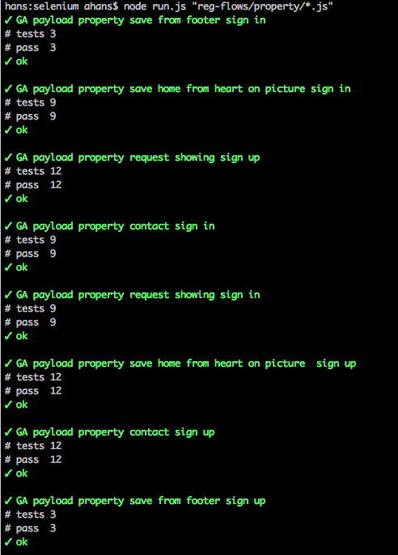

# Selenium tests

## Website testing

Using webdriverio to run tape tests against user flows in the website.

### Setup

Make sure you are running a modern version of node.js

In this repository run the npm install command to get the local packages from npm (webdriverio and tape):

```
npm install
```

You also need to perform one global installation for the selenium standalone server:

```
sudo npm install selenium-standalone@latest -g
sudo selenium-standalone install
```


### Running tests

Before running tests you must start the local selenium server. Each test refers to this and specifies the browsers selenium will drive to run the test scripts:

```
selenium-standalone start
```

Perform a single test with node by referencing the test script:

```
node search-filters.js
```

Run your test with colored output by piping it through faucet:

```
node search-filters.js | faucet
```

## Run parallel batch

Run many tests in parallel by passing a glob file name match pattern to the run script using directory match like ** and/or filename match like:

```
node run.js "reg-flows/property/*.js"
```



The run.js script is piping the output through faucet so you will see the TAP output only, not any other logging occuring during the test.
